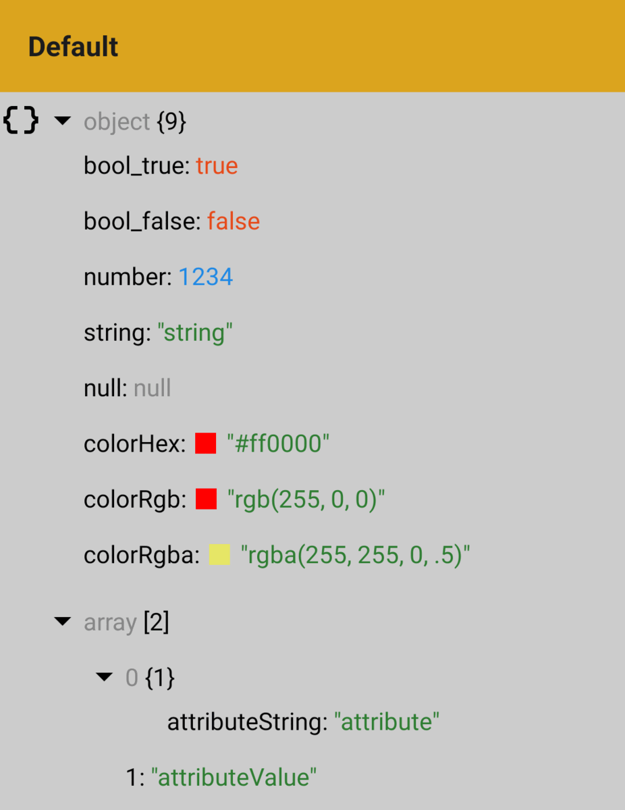

# JSON Viewer
  

### Format
Support multiple JSON `entry`
- JSON string
	- `jsonString = ""`
- JsonElement from `com.google.gson`
	- `element = json`
- JSONObject from `org.json`
	- `jsonObject = object`
- JSONArray from `org.json`
	- `jsonArray = array`

```
JsonUIRoot(
	<entry>,
	modifier = Modifier,
	colorScheme = selectedJsonScheme
)
```

### Scheme
Multiple color `scheme` are availables



- defaultColorScheme()
- JsonDarkScheme
	- .communityMaterial()
	- .github()
	- .darcula()
	- .dracula()
	- .futuristt()
	- .matrix()
- JsonLightScheme
	- .communityMaterial()
	- .github()
	- .winterIsComing()

Else you can inherit of existing to customize it
```
<scheme>(
	background = Color.LightGray,
	rootIcon = Color.Black,
	dropArrowIcon = Color.Black,
	collectionCounterText = Color.Black,
	collectionLabelText = Color.Gray,
	primitiveLabelText = Color.Black,
	primitiveNullText = Color.Gray,
	primitiveNumberText = Color(0xFF1E88E5),
	primitiveStringText = Color(0xFF2E7D32),
	primitiveBooleanTrueText = Color(0xFFE64A19),
	primitiveBooleanFalseText = Color(0xFFE64A19),
)
```
