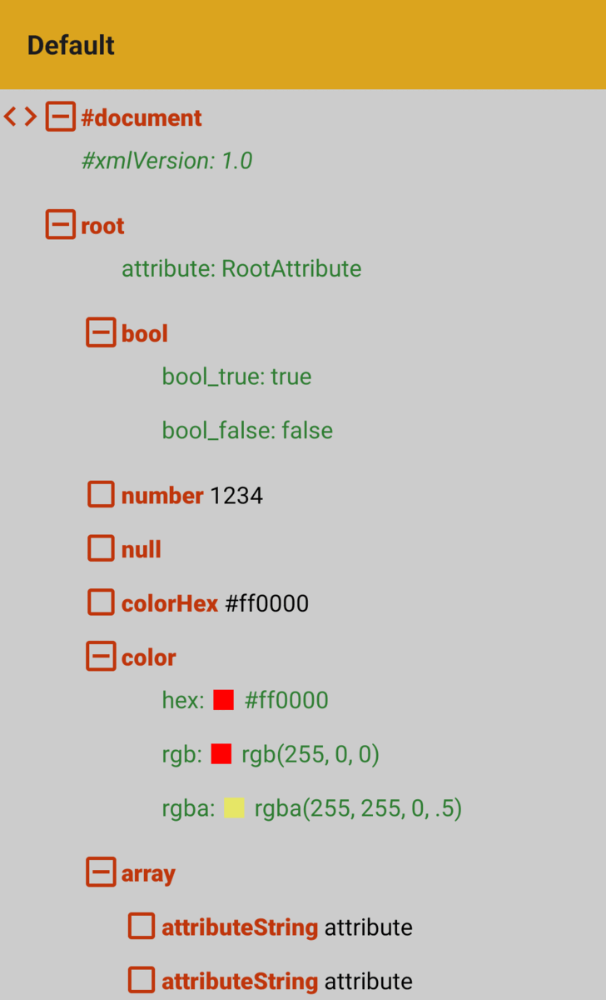

# XML Viewer
  

### Format
Support multiple XML `entry`
- XML string
	- `xmlString = ""`
- XMLElement from this dependency
	- `element = xml`

```
XmlUIRoot(
	<entry>,
	modifier = Modifier,
	colorScheme = selectedJsonScheme
)
```

### Scheme
Multiple color `scheme` are availables



- defaultColorScheme()
- XmlDarkScheme
	- .communityMaterial()
	- .github()
	- .darcula()
	- .dracula()
	- .futuristt()
	- .matrix()
- XmlLightScheme
	- .communityMaterial()
	- .github()
	- .winterIsComing()

Else you can inherit of existing to customize it
```
<scheme>(
    background = Color.LightGray,
    rootIcon = Color(0xFFBF360C),
    collapseIcon = Color(0xFFBF360C),
    nodeNameText = Color(0xFFBF360C),
    nodeInnerText = Color.Black,
    nodeMetadataKeyText = Color(0xFF2E7D32),
    nodeMetadataValueText = Color(0xFF2E7D32),
    nodeAttributeKeyText = Color(0xFF2E7D32),
    nodeAttributeValueText = Color(0xFF2E7D32),
)
```

:information_source: nodeMetadata are custom data retrieve from xml node

:information_source: nodeAttribute are xml attribute like `hex` in the sample below
```
<color hex="#ff0000" />
```
